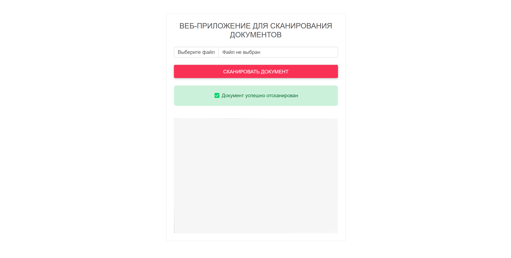

# Сканирование документов

Данное приложение предназначено для обнаружения документов на фото и их сканирования

***Принцип работы приложения***: 
1. **Загрузка изображения**.
2. **Предварительная обработка**: Загруженное изображение преобразуется в оттенки серого и затем применяется фильтр Гаусса для сглаживания и устранения шума.
3. **Обнаружение краев**: Применяется алгоритм Canny для обнаружения краев на изображении.
4. **Поиск контуров**: Используется функция findContours из библиотеки OpenCV для поиска контуров на изображении. Контуры сортируются по площади, и выбираются пять самых больших.
5. **Определение контура документа**: Для каждого контура вычисляется периметр и приближается полигон. Если полигон состоит из четырех вершин, он считается контуром документа.
6. **Преобразование перспективы**: Если контур документа найден, применяется преобразование перспективы, чтобы “выровнять” документ. Это делается путем вычисления матрицы преобразования и применения ее к изображению с использованием функции warpPerspective из OpenCV.
7. **Вывод результата**: Полученное изображение конвертируется в формат PNG, кодируется в base64 и отправляется обратно на веб-сайт для отображения пользователю.

---
## Используемые технологии

***Стек технологий***: **Python** (веб-страница: **html** со стилями из библиотеки **MDB**)

***Библиотеки***: 
* OpenCV (cv2)
* NumPy
* Flask
* PIL (Pillow)
* io
* base64

---
## Пример работы

Состояние по умолчанию

Ошибка при сканировании

Предупреждение при сканировании (неверный формат или превышение максимально допустимого размера изображения)

Успешное сканирование документа (отображается отсканированный документ)

